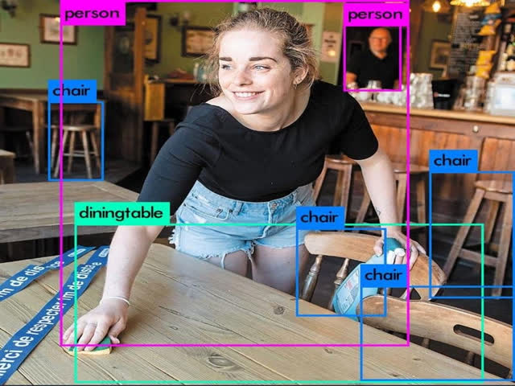

#### 
<table align="center"><tr><td align="center" width="9999">


<p><strong>A python [Flask] api based on opencv and yolov3 for detecting up to 80 objects in image</strong></p>
</td></tr></table>


---
---

api-image-descriptor is developed by SIB, its goal is to provide an image enrichment api with the possibility of detecting up to **80** types of objects, the list of which is referenced on the following link: [supported labels](#labels)

api-image-descriptor uses a combination of **opencv** and **yolov3** in the form of api **flask**. It allows users to send images and retrieve a json containing information relating to the position **(x, y, w, h)** of objects, the confidence score and the index between **(0 and 79)** corresponding to one of the **80** labels supported by api-image-descriptor.

# contents
* [structure](#structure)
* [flowchart](#flowchart)
* [prerequisites](#prerequisites)
* [installation](#installation)
* [building](#building)
* [test](#test)
* [demos](#demos)
* [api && endpoints](#endpoints)

# structure

this project is structured in a modular way is to link to several libraries such **[opencv, numpy, flask, zmq, loguru]** and the pre-trained model yolov3.

It contains the :
* following directories:
    * app
        * flask init and views 
        * link with the file run.py and app.ini
    * constants
        * usefull constants for flask server 
        * usefull constants for deep learning models
    * descriptor
        * object oriented image descriptor class 
        * main object of the project 
        * allows to manipulate image and make detection
    * logger
        * contains log formatting and settings
        * based on loguru 
    * models
        * contains the config file : yolo.cfg 
        * contains the weights file : yolo.weights
        * those two files are required for this app to run
    * test
        * validates the behavior of descriptor
        * based on pytest and hypothesis 
    * utils_readme
        * contains some image, font for readme rendering 
        * can be easily extended by the user 
* following files
    * docker and gitlab confs
        * .dockerignore
        * .gitignore
        * .gitlab-ci.yml
        * Dockerfile
    * application core
        * app.ini (uwsgi conf) 
        * run.py
    * project libraries
        * requirements.txt 


# flowchart

```mermaid
graph TB
    subgraph nms
    I1((accum)) --> I2((check I/U))
    I2 -->I3((filter by threshold))
    I3 -->I4((merge))
    I4 -->I5((return))
    end

    subgraph process
    K1((output)) -->|matrix| K2((split))
    K2 --> K3((coords)) & K4((scores))
    K3 & K4 --> K5[normalize, centered, scaling] 
    K5 --> K7((accum))
    end

    subgraph compute
    L1((request)) -->|image_raw| L2((decode))
    L2 -->|image| L3((blob))
    L3 -->|blob| L4((network))
    L4 -->|prediction| L5((output))
    end
    
    subgraph detection
    M1(client) -->|file|M2(server)
    M2 -->|image|M3(compute)
    M3 -->|position, confidence|M4(process)
    M4 -->|accumulator|M5(nms)
    end
```



# prerequisites
* git
* curl
* python3
* python3-venv 
* build-essential
* uwsgi 
* ffmpeg (optional) 
* libpcre3 && libpcre3-dev (optional)

# installation
```bash
    git clone https://gitlab.ouest-france.fr/sipa-ouest-france/editorial/api-image-descriptor.git
    cd api-image-descriptor
    git checkout -b features/your_features_name
    python -m venv env 
    source env/bin/activate 
    pip install --upgrade pip 
    pip install -r requirements.txt 
```

# building

* with local python and uwsgi  
```bash  
    cd api-image-descriptor
    uwsgi --uid username --ini app.ini
```

* with docker 
```bash
    cd api-image-descriptor
    docker image build -f Dockerfile -t [your_image_name]:[your_image_tag] ./
    docker container run --name [your_container_name] --publish [your_port, choose 8080]:8080 --rm your_image_name:your_image_tag  
```

# test
```bash
    cd api-image-descriptor
    python -m pytest --hypothesis-show-statistics
```

# demos


# endpoints 
* **/is_alive**
    * this route allows us to know if the server is up or not 
    * it can be used in order to check the disponibility of the service
    * ```bash
        curl http://localhost:8080/is_alive
      ```
* **/descript**
    * this is the main route 
    * it is used for to make obect detection 
    * it take an image and render a json with the following format 
    * ths status allows us to check the returned prediction json
    * if status is 0 => the prediction is correct 
    * else, no need to check the other keys 
    * ```json
        {
            "status": "0 | 1", 
            "coords": "array of [x, y, w, h]",
            "scores": "array of confidence score : 0 ~ 1", 
            "labels": "array of index : 0 ~ 79" 
        }
      ```
    * ```bash
        curl -F 'image=@path/to/image.[png,jpg]' http://localhost:8080/descript
      ```